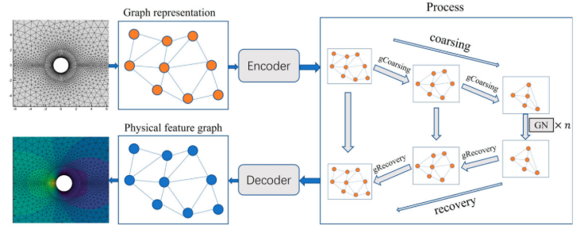

# AI框架和科学计算大作业——AMGNET复现

## 简介

计算流体动力学(CFD)中求解复杂物理系统的偏微分方程是一项计算成本极高的任务。传统基于网格的有限体积或有限元模拟方法虽然被广泛应用，但对于复杂物理问题往往需要消耗大量计算资源才能获得问题的解。流体作为极其复杂的物理系统，其行为由Navier-Stokes方程控制，如何在求解精度和计算成本之间取得平衡一直是CFD领域的核心挑战。

该模型的基本原理就是将网格结构转化为图结构，然后通过网格中节点的物理信息、位置信息以及节点类型对图中的节点和边进行编码。接着对得到的图神经网络使用基于代数多重网格算法(RS)的粗化层进行粗化，将所有节点分类为粗节点集和细节点集，其中粗节点集是细节点集的子集。粗图的节点集合就是粗节点集，于是完成了图的粗化，缩小了图的规模。粗化完成后通过设计的图神经网络信息传递块(GN)来总结和提取图的特征。之后图恢复层采用反向操作，使用空间插值法(Qi et al.,2017)对图进行上采样。例如要对节点 i 插值，则在粗图中找到距离节点 i 最近的 k 个节点，然后通过公式计算得到节点 i 的特征。最后，通过解码器得到每个节点的速度与压力信息。



## 数据集

我们的模型在两个不同的物理场景下进行了评估，如图3所示，包括绕翼型和圆柱体的流动。翼型数据集来自 de Avila Belbute-Peres 等人 (2020) 的研究。该翼型数据集使用了 NACA0012 翼型，表示翼型的网格包含 6648 个节点。圆柱体网格包含 3887 个节点。所有网格都由三角形和四边形元素组成。
### 翼型数据集
*   **物理背景**: 绕翼型的流动，受可压缩的纳维-斯托克斯方程（欧拉方程）支配，条件为稳态、可压缩和无粘。
*   **网格信息**: NACA0012 翼型，包含 6648 个节点，由三角形和四边形元素组成，网格类型为非结构化。
*   **训练集**: 包含攻角 (AoA) 和马赫数 (Mach) 的组合，其中：
    *   `AoA_train = {-10, -9, ..., 9, 10}`
    *   `Mach_train = {0.2, 0.3, 0.35, 0.4, 0.5, 0.55, 0.6, 0.7}`
    *   训练数据对从 `AoA_train × Mach_train` 中均匀采样。
*   **测试集**: 包含攻角 (AoA) 和马赫数 (Mach) 的组合，其中：
    *   `AoA_test = {-10, -9, ..., 9, 10}`
    *   `Mach_test = {0.25, 0.45, 0.65}`
    *   测试数据对从 `AoA_test × Mach_test` 中采样。
### 圆柱体数据集
*   **物理背景**: 绕圆柱体的流动，受不可压缩的纳维-斯托克斯方程（欧拉方程）支配，条件为稳态、不可压缩和无粘。
*   **网格信息**: 圆柱体，包含 3887 个节点，由三角形和四边形元素组成，网格类型为非结构化。
*   **训练集**: 包含雷诺数 (Reynolds number) 的集合：
    *   `Reynolds_number_train = {1.0, 1.5, 2, ..., 37.5, 38, 38.5}`
    *   训练数据直接来自 `Reynolds_number_train`。
*   **测试集**: 包含雷诺数 (Reynolds number) 的集合：
    *   `Reynolds_number_test = {3.5, 10, ..., 33, 39}`
    *   测试数据直接来自 `Reynolds_number_test`。

### 数据集下载

https://aistudio.baidu.com/aistudio/datasetdetail/198187

## 快速开始

直接运行目录下的amgnet.ipynb文件即可

### 环境参数

本任务基于ModelArts平台完成，使用镜像为pytorch1.10-cuda10.2-cudnn7-ubuntu18.04

除镜像已有内容，相关依赖如下

```
torch-cluster===1.5.9 
torch-geometric===2.0.2 
torch-scatter===2.0.9 
torch-sparse===0.6.12 
pyamg
```

具体依赖安装已在notebook中编写，无需单独安装。

### 注意

airfoil使用的min_nodes为2000

cylinder使用的min_nodes为20000

模型创建后需要注意更新min_nodes的值

## 复现结果

### Airfoil机翼数据集

#### x方向流速


#### y方向流速


#### 压力


### Cylinder圆柱体数据集

#### x方向流速


#### y方向流速


#### 压力

